# Jugalbandi — Midway Project Report

**Reinforcement Learning for Schema-Adherent Generation Under Dynamic Constraint Drift, via Indian Classical Music**

| | |
|---|---|
| **Author** | Jay Choukiker |
| **Institution** | IPS Academy Indore |
| **Report date** | 2026-09-06 |
| **Repository** | `Raaga_trial_1` |
| **Origin** | Built for the Meta PyTorch OpenEnv Hackathon (2026-04-25/26); repurposed as a university mini-project |

---

## 1. Abstract

Jugalbandi is a custom [OpenEnv](https://github.com/pytorch)-compatible reinforcement learning environment that trains a language-model policy to compose within the grammar of an Indian classical raga — a formal, rule-governed melodic system — and to keep adhering to that grammar even when the active rule set changes mid-episode without any explicit signal. The project frames raga grammar as a stand-in for a broader, practically important problem: **schema adherence under drift**, i.e. how an LLM-driven agent should behave when the "contract" it must satisfy (an API schema, a compliance rule set, a validation policy) changes while the agent is mid-task and nobody tells it directly.

The system has four moving parts: a Gymnasium-based RL environment with a hand-authored music-theory rule engine and a five-layer reward function; a FastAPI HTTP server exposing that environment in an OpenEnv-compatible shape; a browser-based interactive demo (sitar + tabla UI) for human-in-the-loop call-and-response play; and a GRPO (Group Relative Policy Optimization) fine-tuning pipeline intended to train a small open-weight LLM (Qwen2.5-0.5B-Instruct via Unsloth) against the environment's reward signal.

**Current status in one line:** the environment core is implemented, tested, and mechanically sound; the demo UI and server are wired end-to-end at the API level; the training pipeline is drafted but has never been executed against a real model, and no trained checkpoint, reward curve, or quantitative result exists yet. This report documents exactly what is done, what is stubbed, what is broken, and what remains — with evidence from the code and test suite, not just the pitch documents.

---

## 2. Problem Statement & Motivation

Production LLM systems routinely operate against schemas and rule sets that change: an API drops or renames a field, a compliance policy is updated, a downstream consumer starts rejecting a format that used to be valid. Models trained before the change keep generating output shaped by the old rules — they don't know the rules moved, and there is rarely labeled data for the new schema on day one. This is the **schema-drift problem**, and it's the specific reason Snorkel AI and Patronus AI (hackathon sponsors) called it out as a sub-theme.

Testing an agent's ability to detect and adapt to drift is awkward in a JSON/API setting because failures are invisible to anyone but the engineer reading logs. Jugalbandi's core design bet is to encode the *same structural problem* — strict rules, a required-pattern requirement, context-sensitive validity, an unannounced rule change, a graceful-adaptation window — inside a domain where a rule violation is **instantly audible**: Hindustani classical music. A raga is, functionally, a DSL: a fixed set of legal notes, a note that must be avoided in one melodic direction but not another, required signature phrases, and a hierarchy of "important" notes. Two ragas (Yaman and Bhairav) share partial structure but diverge sharply, and switching between them mid-composition is the "drift event."

The claim under test: *can an LLM policy learn, from reward alone (no supervised labels, no explicit "the rule changed" flag), to infer that a raw continuous control value has silently changed the active rule set, and re-converge on the new rule set quickly?*

---

## 3. System Architecture

```mermaid
flowchart TB
    subgraph Browser["Browser Demo (ui/)"]
        UI[app.js — state machine]
        Sitar[sitar.js — 7-string instrument]
        Tabla[tabla.js — 16-beat clock]
        Client[env_client.js — HTTP client]
        UI --> Sitar
        UI --> Tabla
        UI --> Client
    end

    subgraph Server["OpenEnv HTTP Server (openenv_server/)"]
        API[FastAPI app]
        Endpoints["/reset /step /set_dial /call /state /health"]
        API --> Endpoints
    end

    subgraph Env["RL Environment (raaga_env/)"]
        Base[RaagaEnv — Gymnasium base, 14-dim obs]
        Jug[JugalbandiEnv — extends base, 22-dim obs]
        Drift[DriftManager — grace period + adaptation bonus]
        Reward[compute_reward — 5-layer reward function]
        Ragas[ragas.py — Yaman / Bhairav rule dicts]
        Base --> Jug
        Jug --> Drift
        Jug --> Reward
        Reward --> Ragas
        Drift --> Ragas
    end

    subgraph Training["Training Pipeline (training/) — NOT YET RUN"]
        Script[train_grpo.py]
        Model[Qwen2.5-0.5B-Instruct + Unsloth QLoRA]
        GRPO[TRL GRPOTrainer]
        Script -.would load.-> Model
        Script -.would use.-> GRPO
    end

    Client -- HTTP --> API
    Endpoints --> Jug
    Script -. HTTP calls to /step & /reset .-> Endpoints

    style Training fill:#3a1a1a,stroke:#a33,stroke-dasharray: 5 5
```



**Data flow:** the browser UI drives the environment purely through HTTP calls to the FastAPI server, which wraps a single long-lived `JugalbandiEnv` instance. The environment computes a 22-dimensional observation and a scalar reward on every step, using the raga rule dictionaries and the drift state machine. The training script is architecturally wired to hit the same HTTP endpoints — the intent is that a GRPO trainer running in Colab treats the deployed environment server as a black-box reward oracle. That closes the loop from "human plays sitar in a browser" to "LLM policy is fine-tuned against the identical reward function," which is the project's most distinctive design choice.

---

## 4. What Is Actually Done (Verified, Not Just Claimed)

Everything in this section was confirmed directly against the code and by running the test suite — not taken from the planning docs.

### 4.1 Core RL Environment — ✅ Complete and tested

| Component | File | Status |
|---|---|---|
| Base Gymnasium environment | `raaga_env/env.py` (179 lines) | Implemented: 14-dim obs, 96-action discrete space (2 octaves × 4 durations), tala tracking, pakad/vadi drought counters |
| Drift/call-response extension | `raaga_env/jugalbandi_env.py` (172 lines) | Implemented: 22-dim obs, human call-phrase injection every 8 steps, dial-driven raga switching |
| Raga rule engine | `raaga_env/ragas.py` (128 lines) | Two full raga definitions (Yaman, Bhairav) with valid/forbidden notes, direction-sensitive aaroha rules, vadi/samvadi, pakads, tala (Teentaal) |
| Drift state machine | `raaga_env/drift.py` (79 lines) | Grace period (3 steps, 80% penalty reduction), adaptation bonus (+3.0 within 5-step window) |
| Reward function | `raaga_env/reward.py` (128 lines) | All 5 claimed layers present: hard rules, soft rules, sequence-level (pakad/tala), jugalbandi (call-response), drift-specific |

This is real, working code — not a stub. The reward function alone runs 5 distinct scoring passes per step and returns a structured breakdown dict for every reward component, which is what lets the (unrun) training pipeline log per-component reward curves later.

### 4.2 Automated Tests — ✅ 20 / 20 passing (100%)

The test suite (`raaga_env/tests/test_env.py`, `test_reward.py`, 20 tests total) initially ran at 18/20 after installing the missing `gymnasium` dependency into the project's own virtualenv (it had never actually been installed there — see §5.3):

```
18 passed, 2 failed in 0.45s

FAILED test_env.py::test_pakad_detection        — assert 0 >= 1
FAILED test_reward.py::test_pakad_completion_bonus — 'pakad_completion' not in breakdown
```

Both failures traced to the same root cause: Yaman's pakad list had no entry for the mandra-register "Ni Dha Pa" descent, so neither `env.py` nor `reward.py` could ever match it (see §5.5 for the original analysis and fix). That fix is now applied — the missing phrase was added to `raaga_env/ragas.py`, and the previously duplicated matching logic in `env.py`/`reward.py` was consolidated into one shared `match_pakad()` helper so the two code paths can't drift apart again:

```
20 passed in 0.19s
```

All 20 tests pass — forbidden-note penalties, vadi/samvadi bonuses, grace-period penalty reduction, dial-triggered raga switching, jugalbandi tension-resolve reward, observation shape and bounds, and now pakad detection.

### 4.3 HTTP Server — ✅ Implemented, matches OpenEnv shape

`openenv_server/server.py` (130 lines) is a working FastAPI app exposing `/reset`, `/step`, `/set_dial`, `/call`, `/state`, `/health`, with Pydantic-validated request bodies and CORS enabled for browser access. It was not load-tested or deployed, but the endpoint logic directly calls the verified `JugalbandiEnv` methods and returns JSON-serializable observations.

### 4.4 Browser Demo UI — ✅ Implemented, functionally complete for the "solo + call-response" flow

`ui/app.js`, `sitar.js`, `tabla.js`, `env_client.js` (452 lines total) implement a real state machine: idle → human plays 4 notes on a rendered sitar → call submitted to server → AI "responds" for 4 steps → reward breakdown logged live → loop. The raga dial UI element calls `/set_dial` and reflects grace-period status.

### 4.5 Domain Modeling Rigor — ✅ Above hackathon-project average, self-audited

A dedicated audit document (`docs/CLASSICAL_MUSIC_AUDIT.md`) independently checked the raga rule dictionaries against Bhatkhande's standard Hindustani music theory reference and catalogued exactly which parts were correct (scales, forbidden notes, Teentaal structure, Yaman vadi/samvadi) versus wrong (an earlier Bhairav vadi/samvadi assignment) versus simplified (no andolan/meend/microtones, discrete 12-TET approximation). **The two highest-impact fixes from that audit are already applied in the current code**: Bhairav's vadi/samvadi is correctly set to komal Dha (8) / komal Re (1) in `ragas.py`, and the action space was expanded from a single octave (Discrete 48) to two octaves (Discrete 96) to make cross-octave pakads reachable. This self-critique-then-fix cycle is worth highlighting in a presentation — it shows engineering discipline, not just a first draft.

### 4.6 Documentation & Planning Artifacts — ✅ Extensive

- `docs/PHASE_PLAN.md` — a detailed 36-hour execution plan with an explicit hard gate ("Track A must run end-to-end by hour 20 or Track B freezes")
- `docs/Jugalbandi.md` — a full pitch document: problem framing, demo script, anticipated judge Q&A with prepared answers, competitive analysis against other environment types
- `docs/Train.md` — a from-scratch tutorial explaining every training decision (why Qwen2.5-0.5B, why Unsloth/QLoRA, why GRPO over PPO, cell-by-cell Colab notebook plan) — written at a teaching level, not just notes
- `docs/CLASSICAL_MUSIC_AUDIT.md` — the domain-accuracy audit described above
- `docs/Mid_life_crisis.md` — a self-administered adversarial review ("Meta engineer judge hat") stress-testing the pitch's weaknesses honestly (overfitting risk, audio quality reality check)
- `openenv.yaml` — an OpenEnv manifest declaring the environment's observation/action spaces, reward range, and a judging rubric

---

## 5. What Is Not Done Yet

This is the part a professor or panel will probe. Be precise about it rather than letting the polished pitch docs imply otherwise.

### 5.1 No model has ever been trained

There is no notebook (`.ipynb`), no saved checkpoint directory, no `wandb` run folder, and `assets/reward_curves/` — the directory explicitly created to hold the "before vs. after training" reward plot that the project's own Phase Plan calls the mandatory evidence for the "Showing Improvement in Rewards" criterion — is **empty**. Every specific number quoted in the pitch documents (reward climbing from −8 to +4, adaptation speed of 3.4 ± 1.5 steps, 72% adaptation success rate, forbidden-note rate dropping from 25% to 5%) is a **projected/target number written before any run**, not a measured result. `docs/Jugalbandi.md` and `docs/Train.md` are written in a confident, past-tense pitch voice ("we measured," "our trained agent shows"), which will read as misrepresentation if presented as-is without the disclaimer that these are targets, not results.

### 5.2 The training script's three acknowledged bugs — ✅ fixed

`docs/Train.md` §5 documented these against the original `training/train_grpo.py`; all three are now fixed:

1. **Environment state drift during batch reward** — GRPO samples 4 completions per prompt, but `env_reward()` stepped the live environment once per completion sequentially, so the 4 completions being compared were evaluated at 4 different environment states, invalidating the group comparison GRPO relies on. Fixed: `env_reward()` now calls `/reset` before scoring each completion.
2. **`build_dataset()` used a dummy all-zero observation** instead of the real observation returned by the environment, so every seed prompt looked identical to the model regardless of actual game state. Fixed: it now threads the real `observation` array through from the `/reset`/`/step` responses.
3. **Wrong submission format** — only a `.py` script existed; the hackathon (and a demo-ready deliverable generally) needs a runnable `.ipynb`. Fixed: `training/train_grpo.ipynb` now exists, mirroring the 11-cell structure from `docs/Train.md` §6 (`train_grpo.py` is kept alongside it for local dev/debugging).

None of this has been *run* yet, though — see §5.1 and the new §9 runbook for how to actually execute a training pass.

### 5.3 The project has never been run end-to-end, even once, in its own environment

The project's own `venv/` had none of its declared dependencies (`gymnasium`, `numpy`, `pytest`) installed — running the test suite for this report required installing them first. This means the Phase 0 setup checklist in `docs/PHASE_PLAN.md` ("`pytest raaga_env/tests/ -v` — all tests must pass before touching anything else") was never actually completed as written; the tests had not been run in-repo before now.

### 5.4 No deployment artifacts

No HuggingFace Space, no pushed model weights, no HF blog post, no recorded demo video — all of these are listed as "Required Submission Artifacts" in the knowledge graph extraction (§8) and remain unchecked.

### 5.5 Known code bugs (beyond the training script)

- **Pakad detection bug — ✅ fixed.** Both `RaagaEnv._update_state` and `compute_reward` independently checked whether the recent note history matched a pakad phrase, each building its own comparison window. On inspection, the two windows were actually equivalent for the failing cases — the real problem was a missing phrase: Yaman's `pakads` list had no entry for the mandra-register "Ni Dha Pa" descent (notes 11, 9, 7), which is exactly what the two failing tests played, so neither code path could ever match it. Fix applied: added `([11, 9, 7], 1.0)` to `raaga_env/ragas.py` (the mandra-register head of the avaroha, a legitimate standalone cadential phrase), and extracted the duplicated matching loop into one shared `match_pakad()` helper in `ragas.py` that both `env.py` and `reward.py` now call, so the two code paths can no longer silently diverge. Result: 20/20 tests passing (§4.2, §11).
- **`openenv.yaml` is out of date** relative to the code: it declares `action_space.n: 48` and a 22-dim observation description that doesn't match the actual dimension layout documented in `jugalbandi_env.py`'s own docstring (the manifest was written before the action space was expanded to 96 for the octave-bug fix, and not updated afterward).
- **`ui/app.js:runAIResponse()` has a hardcoded placeholder action** (`action 4`, "always play Ga") instead of calling a trained model — explicitly flagged with a `// TODO` in the code itself. This is expected at this stage (no model exists yet to call), but it means the demo currently cannot show the "AI adapts to drift" moment that is the centerpiece of the pitch's Act 4 — the AI's responses are not actually AI-driven yet.
- The knowledge graph audit (`graphify-out/GRAPH_REPORT.md`) independently flagged the `runAIResponse() → step()` connection as an *inferred, unverified* edge for exactly this reason — the UI-to-training-pipeline link is documented intent, not a working connection yet.

---

## 6. Effort Breakdown (Honest Accounting)

| Layer | Design | Implementation | Testing | Validation against real training |
|---|---|---|---|---|
| RL environment + reward engine | Done | Done | 90% passing | N/A (deterministic, testable directly) |
| Domain/music-theory correctness | Done (audited) | Done, audit fixes applied | Self-audited against Bhatkhande reference | N/A |
| HTTP server (OpenEnv shape) | Done | Done | Not load-tested / not deployed | N/A |
| Browser demo UI | Done | Done (solo + call-response flow) | Manually described only, no test harness | AI side is a placeholder, not a trained policy |
| GRPO training pipeline | Done (very thorough design doc) | Drafted, 3 known bugs unfixed | Never executed | **Never run — zero results exist** |
| Deployment (HF Space, model push, video) | Planned | Not started | — | — |

**Rough completion estimate: ~55–60%** of the full pipeline described in the pitch. The **research/engineering-design layer is essentially finished and above-average in rigor** (the self-audit and adversarial review documents are not typical of a hackathon or mini-project — most teams don't write a document arguing against their own claims). The **empirical/results layer — the part that turns "we designed an interesting environment" into "we proved something works" — has not started.**

---

## 7. Risks Carried Forward From the Original Plan

From `docs/PHASE_PLAN.md`, still live:

| Risk | Status now |
|---|---|
| Tests fail in Phase 0 | Partially materialized — 2 of 20 fail, root-caused in this report (§5.5) |
| GRPO trainer crashes on Colab | Unknown — never attempted; the 3 documented bugs make a crash or invalid training run likely on first attempt |
| Trained model too slow for live inference | Not yet reachable — no model exists |
| UI audio doesn't work on iOS | Not yet tested on a physical device |

---

## 8. Path to a Finished Project (Priority Order)

1. **Fix the pakad-detection bug** (§5.5) — small, well-isolated, makes the test suite fully green. High value for a report: "20/20 tests passing" is a clean line to present.
2. **Fix the 3 documented training-script bugs** in `train_grpo.py` (reset-per-completion, real observation in `build_dataset`, convert to notebook).
3. **Run one real training pass** — even a short one (50–100 GRPO steps on a free Colab T4). The goal is not a polished result; it's replacing every projected number in the report with one real, honestly-labeled measured number (even if it's a modest improvement).
4. **Update `openenv.yaml`** to match the current action/observation space.
5. **Wire `runAIResponse()` to real inference** — either a local checkpoint endpoint or an HF Inference API call — so the demo's Act 3/4 moment is genuinely model-driven.
6. **Re-run the full test suite plus a manual end-to-end walkthrough** (start episode → play call phrase → observe AI response → drag the drift dial → observe grace period + adaptation) and capture screenshots/a short recording as evidence for the report/presentation.
7. Optional stretch, if time allows: record actual reward curves and an adaptation-speed measurement, even on a small scale, to replace the placeholder numbers in `docs/Jugalbandi.md` before reusing that document's language in a presentation.

---

## 9. Deployment & Training Runbook: GCP Credits + Hugging Face

This section is the practical "how do I actually see this run" guide — written to take the project from §5.1's "never trained" state to a live, model-driven web demo. It assumes the fixes in §5.5 and §5.2 are applied (they are, as of this revision — see §10 for the clean test run).

### 9.1 The one real gap before any of this produces music

`ui/app.js:100-105` (`runAIResponse()`) hardcodes `action 4` with a `// TODO: replace with trained model inference endpoint when ready` comment. `openenv_server/server.py` has no inference endpoint at all — it only exposes the environment (`/reset /step /set_dial /call /state /health`). **Training a model and deploying the server as-is will not make the browser demo AI-driven.** Two additions are required, neither built yet:

1. A `POST /infer` endpoint on the server that loads the trained LoRA adapter (merged with the base Qwen2.5-0.5B weights) and, given the current observation, returns an action int.
2. A change to `runAIResponse()` in `ui/app.js` to call that endpoint instead of the hardcoded `4`.

Everything below gets you to "trained checkpoint on the Hub" — closing the two items above is a follow-up (ask for it explicitly; it's a small, well-scoped addition to `server.py` and `app.js`, not a redesign).

### 9.2 Training — pick Colab (free) or GCP (your $300 credit)

**Colab is the default recommendation.** A 300-step GRPO run on a free T4 takes ~45–60 minutes (see `docs/Train.md` §9's timing table) and costs nothing. Use `training/train_grpo.ipynb`, follow Cells 1–11 in order, don't skip Cell 5 (server-reachability check).

Use GCP instead only if Colab's session limits/disconnects are actually blocking you, or you want a longer run (500+ steps) without babysitting a browser tab. Here's the exact path:

**a. One-time setup**
```
gcloud auth login
gcloud config set project YOUR_GCP_PROJECT_ID
gcloud services enable compute.googleapis.com
```
New/free-trial GCP projects usually start with **0 GPU quota**. Check and request before creating anything: Console → IAM & Admin → Quotas → filter `NVIDIA T4 GPUs` (region `us-central1`) → Edit Quotas → request `1`. This is often auto-approved in minutes; occasionally takes a few hours. Do this first — don't wait until you're trying to launch the VM.

**b. Create the GPU VM** (Deep Learning VM image — CUDA/PyTorch preinstalled, saves an hour of driver wrangling):
```
gcloud compute instances create jugalbandi-gpu \
  --zone=us-central1-a \
  --machine-type=n1-standard-8 \
  --accelerator="type=nvidia-tesla-t4,count=1" \
  --image-family=pytorch-latest-gpu \
  --image-project=deeplearning-platform-release \
  --maintenance-policy=TERMINATE \
  --boot-disk-size=100GB \
  --preemptible
```
`--preemptible` cuts the price ~70% (T4 on-demand is ~$0.35/hr in `us-central1`; preemptible is roughly $0.11/hr). A single training run is under an hour, so preemption risk is low and the cost either way is a few dollars out of the $300 credit — not worth over-optimizing.

**c. SSH in and let it provision the driver:**
```
gcloud compute ssh jugalbandi-gpu --zone=us-central1-a
```
First connection triggers NVIDIA driver install — wait ~2 minutes, then confirm with `nvidia-smi`.

**d. On the VM — clone, install, run:**
```
git clone <your-repo-url> jugalbandi && cd jugalbandi
pip install -r requirements.txt
pip install "unsloth[colab-new] @ git+https://github.com/unslothai/unsloth.git"
pip install trl==0.8.6 wandb

python openenv_server/server.py &                      # env server, background, port 7860
python training/train_grpo.py --server http://localhost:7860 --steps 300
```
Set `WANDB_API_KEY` and `HF_TOKEN` as env vars first (`export WANDB_API_KEY=...`) if you want logging and a Hub push.

**e. Get the checkpoint out, then kill the VM immediately:**
```
# from your local machine:
gcloud compute scp --recurse jugalbandi-gpu:~/jugalbandi/checkpoints/jugalbandi-grpo-v1/final ./checkpoint --zone=us-central1-a

# or, from the VM, push straight to the Hub instead of downloading:
huggingface-cli login
huggingface-cli upload YOUR_HF_USERNAME/jugalbandi-qwen-grpo ./checkpoints/jugalbandi-grpo-v1/final

# then, always:
gcloud compute instances delete jugalbandi-gpu --zone=us-central1-a
```
The VM (not just the GPU) bills while it exists, running or stopped, because of the attached disk. Delete it — don't just stop it — once you have the checkpoint.

### 9.3 Getting the environment + demo onto the web

The env server already has a working `Dockerfile` (`openenv_server/Dockerfile`) — it just doesn't serve the model or the UI yet. Until §9.1's `/infer` endpoint exists, the fastest path to *something* live is:

1. Push `openenv_server/Dockerfile` as a Hugging Face Space (Docker SDK) — `huggingface-cli repo create jugalbandi-env --type space`, then push the repo with the Dockerfile at root (HF Spaces expects it there, or set `sdk: docker` + `app_port: 7860` in the Space's `README.md` frontmatter).
2. Host `ui/` as a second, static HF Space (SDK: `static`), with `ui/index.html:67` pointing `window.ENV_SERVER_URL` at the deployed server Space's URL instead of `localhost:7860`.
3. At this point you have the *human* side of the demo (sitar + tabla + call-response) live and working end to end — but the AI side still plays the hardcoded note until §9.1 is closed.

Once `/infer` exists, add `torch`, `transformers`, `peft`/`unsloth`, and the adapter weights (either baked into the image or pulled from the Hub at container start) to the server's Dockerfile and redeploy the same Space — no separate hosting needed for the model.

### 9.4 Cost reality check

Total spend for one real training run + a live demo: Colab path is $0. GCP path is a few dollars (one T4-hour, preemptible) out of the $300 credit — save the rest; it's not needed for hosting (HF Spaces' free CPU tier is enough for a 0.5B 4-bit model at inference-only, low-QPS, single-demo scale).

---

## 10. Why This Is Still a Strong Mini-Project, As-Is

Even without a completed training run, this project already demonstrates several things worth foregrounding to a panel:

- **A non-trivial custom Gymnasium environment** with a genuinely multi-layered reward function (5 layers, mutually interacting), not a toy CartPole variant.
- **A defensible mapping from a cultural/artistic domain to a real ML systems problem** (schema drift), argued coherently and in enough depth to survive adversarial questioning (see `docs/Jugalbandi.md`'s prepared Q&A and `docs/Mid_life_crisis.md`'s self-critique).
- **Full-stack integration**: a real-time browser UI, a REST API server following an external environment-interop standard (OpenEnv), and an RL training script all sharing one source of truth for the reward function.
- **Evidence of an iterative, self-correcting engineering process**: an independent domain-accuracy audit was commissioned against the code, and its two highest-priority fixes were verifiably applied.
- **Honest internal documentation of what's broken**, which — presented correctly — is itself a mark of engineering maturity rather than a weakness. A report that says "here is exactly what's real, here is exactly what's projected, here is the fix list" is more credible to an evaluator than a report that blurs the two.

The main gap between "solid mini-project" and "portfolio-grade, resume-worthy project" was §8, items 1–2 (the isolated bugs — both now fixed) and item 3: produce **one real, small, honestly-reported training result** (runbook in §9). That is a matter of hours, not a redesign — the hard design work is already done.

---

## 11. Appendix: Test Run Output (Raw Evidence)

**Original run** (before the §5.5 fix), against a freshly-installed `gymnasium`/`numpy`/`pytest` in the project's own `venv/`, which did not have these dependencies present prior to this audit:

```
$ python -m pytest raaga_env/tests/ -v
============================= test session starts =============================
collected 20 items

test_env.py::test_reset_obs_shape                    PASSED
test_env.py::test_vadi_gives_positive_reward          PASSED
test_env.py::test_forbidden_note_penalty              PASSED
test_env.py::test_episode_terminates_at_length        PASSED
test_env.py::test_obs_always_in_bounds                PASSED
test_env.py::test_pakad_detection                     FAILED  (assert 0 >= 1)
test_env.py::test_bhairav_forbidden                   PASSED
test_env.py::test_jugalbandi_obs_shape                PASSED
test_env.py::test_dial_switches_raga                  PASSED
test_env.py::test_grace_period_reduces_penalty        PASSED
test_env.py::test_set_call_updates_tension            PASSED
test_reward.py::test_forbidden_note_returns_minus_two PASSED
test_reward.py::test_valid_note_positive              PASSED
test_reward.py::test_vadi_bonus                       PASSED
test_reward.py::test_pakad_completion_bonus           FAILED  ('pakad_completion' not in breakdown)
test_reward.py::test_sam_vadi_landing                 PASSED
test_reward.py::test_grace_factor_reduces_penalty     PASSED
test_reward.py::test_repetition_penalty               PASSED
test_reward.py::test_jugalbandi_tension_resolve       PASSED
test_reward.py::test_jugalbandi_direction_contrast    PASSED

======================== 2 failed, 18 passed in 0.45s =========================
```

**Re-run after the §5.5 fix** (missing pakad phrase added, matching logic consolidated into `match_pakad()`):

```
$ venv/Scripts/python.exe -m pytest raaga_env/tests/ -v
============================= test session starts =============================
collected 20 items

test_env.py::test_reset_obs_shape PASSED
test_env.py::test_vadi_gives_positive_reward PASSED
test_env.py::test_forbidden_note_penalty PASSED
test_env.py::test_episode_terminates_at_length PASSED
test_env.py::test_obs_always_in_bounds PASSED
test_env.py::test_pakad_detection PASSED
test_env.py::test_bhairav_forbidden PASSED
test_env.py::test_jugalbandi_obs_shape PASSED
test_env.py::test_dial_switches_raga PASSED
test_env.py::test_grace_period_reduces_penalty PASSED
test_env.py::test_set_call_updates_tension PASSED
test_reward.py::test_forbidden_note_returns_minus_two PASSED
test_reward.py::test_valid_note_positive PASSED
test_reward.py::test_vadi_bonus PASSED
test_reward.py::test_pakad_completion_bonus PASSED
test_reward.py::test_sam_vadi_landing PASSED
test_reward.py::test_grace_factor_reduces_penalty PASSED
test_reward.py::test_repetition_penalty PASSED
test_reward.py::test_jugalbandi_tension_resolve PASSED
test_reward.py::test_jugalbandi_direction_contrast PASSED

============================= 20 passed in 0.19s ==============================
```
